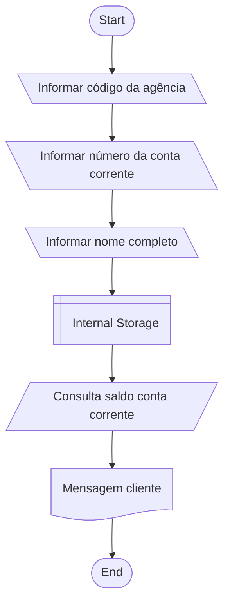

# Criação de aplicação para conta corrente

Criação de aplicação para obter informações dos clientes para abertura de conta corrente com mensagem final parabenizando o cliente

## Campos

| Campo   | Tipo       | exemplo                           | Origem da Informação |
| :---------- | :--------- | :---------------------------------- |-----------------|
| `Agency` | `string` | 067-8 | `Clientes`|
| `Current Account` | `inteiro` | 1021 | `Clientes`|
| `Customer name` | `string` | Mário Andrade| `Clientes`|
| `Current Account Balance` | `Inteiro` | 237.48 | `Banco`|

## Mensagem final
"Olá [Customer name], obrigado por criar uma conta em nosso banco, sua agência é [Agency], conta [Current Account] e seu saldo [Current Account Balance] já está disponível para saque".

## Fluxograma

## Linguagens utilizadas
- Java Versão 21.0.7

## Referências

 - [DIO - Trilha Java básico](https://github.com/digitalinnovationone/trilha-java-basico/blob/main/desafios/sintaxe/README.md)

## Autores

- [@Anderson-G-Silva](https://github.com/Anderson-G-Silva)

